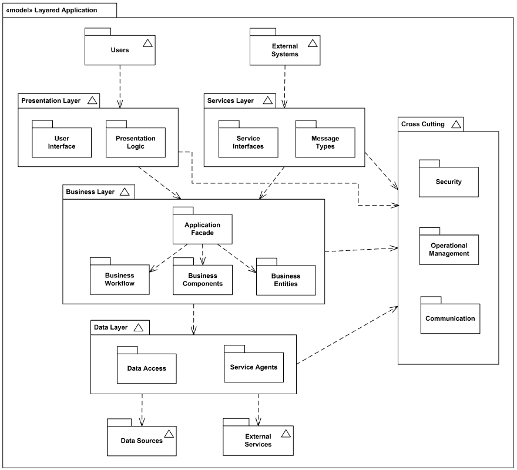

********
Tutorial
********

An example
==========

We are going to model the following diagram:

The equivalent representation of this model is available in tutorial-example.py
at the root of the project directory.

All functionalities
===================

Further development
===================

A large number of potential errors are managed using exceptions. However, some
of them are not taken into account, or silently corrected.
For instance, in case of multiple definition of the same key in a json object,
the default behavior of the :mod:`json` parser is to keep the last value. This
default behavior is inherited by our parser that does not raise en error if a key
is defined more than once in the json representation of a Rauzy model.

The management of all these errors not being the point of the project, they have
not been exhaustively listed and taken into account. However we can note that:

- The full correctness of any Rauzy objects designed using the API is not
  ensured. It is possible to do so maintaining invariants but it adds huge
  constraints on the use of the API functions. For instance, in order to ensure
  that any given relation links existing objects, a relation should be added
  first and then its toSet and fromSet fields filled.

  For that reason, correct models are the responsability of the user. However,
  there is some support to inform the user that his or her actions may lead to
  inconsistent models (for example, setting the toSet or fromSet of a relation
  without having added the relation in an object will raise a warning).
